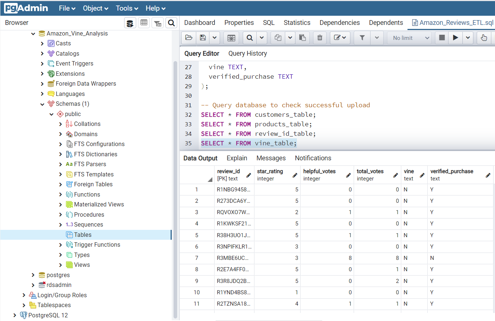

# Amazon Vine Analysis

The purpose of this project was to use Pyspark and the ETL process to analyze Amazon reviews written by members of the paid Amazon Vine program to determine if there is any bias toward favorable reviews from Vine members in the dataset.  The dataset was first Extracted, Transformed and Loaded into an Amazon Web Services (AWS) RDS instance of a Postgres database and then the transformed data was anlayzed. To measure the bias, the following calculations were compared:
1. The percentage of 5-star reviews from members of the Amazon Vine program
2. The percentage of 5-star reviews from non-members of the Amazon Vine program.

### Resources
Data: https://s3.amazonaws.com/amazon-reviews-pds/tsv/amazon_reviews_us_Camera_v1_00.tsv.gz </br>
Resources: Google Colab, AWS, PySpark, S3, PostgreSQL, RDS

### Results
After extracting, transforming and loading the dataset, the following table of data from reviews was used for the analysis.
```py
  # Create the vine_table DataFrame
  vine_df = df.select(['review_id', 'star_rating', 'helpful_votes', 'total_votes', 'vine', 'verified_purchase'])
  vine_df.show()
```


Below is the table loaded into PostgreSQL.


To perform the analysis, the table first needed to be filtered to clean up the data.  The table was filtered to only keep rows where total_votes were greater than or equal to 20 and then where helpful_votes divided by total_votes was greater than or equal to 50%.  This helped to ensure that the data used for the analysis was capturing reviews that were more likely to be helpful to users.

```py
  # Retrieve all rows where total_votes is >= 20
  filtered_vine_df = vine_df.filter(vine_df['total_votes'] >= 20)
  filtered_vine_df.show(5)
   
  # Retrieve all the rows where helpful_votes divided by total_votes is >= 50%
  filtered2_vine_df = filtered_vine_df.filter(filtered_vine_df['helpful_votes'] / filtered_vine_df['total_votes'] >= .5)
  filtered2_vine_df.show(5)
```

After filtering, the table was separated into two different tables; one for reviews that were from members in the Amazon Vine program (where the 'vine' column was equal to 'Y'), and one for reviews that were from non-members of the Amazon Vine program (where the 'vine' column was equal to 'N').  The resulting tables are shown below.
```py
  # Retrieve all rows where vine = Y
  Y_vine_df = filtered2_vine_df.filter(filtered2_vine_df['vine'] == 'Y')
  Y_vine_df.show(5)
```


```py
  # Retrieve all rows where vine = N
  N_vine_df = filtered2_vine_df.filter(filtered2_vine_df['vine'] == 'N')
  N_vine_df.show(5)
```


With the data now cleaned and broken down into two tables based on membership of the Amazon Vine program, the calculations for the analysis were completed.  The results were as follows and are summarized in the table below.
- Quantities of reviews
  - The total number of Vine reviews (members of Amazon Vine) was 607.
  - The total number of non-Vine reviews (non-members) was 50522.
- Quantities of 5-star reviews
  - The total number of 5-star reviews from Amazon Vine members was 257.
  - The total number of 5-star reviews from non-members was 25220.
- Percentages of 5-star reviews
  - The percentage of Vine reviews that were 5-stars was 42.3%.
  - The percentage of non-Vine reviews that were 5-stars was 49.9%.


### Summary  
Based on the results of the analysis, there does not appear to be any positivity bias for reviews from members of the Amazon Vine program.  With 42.3% of Vine reviews being 5-stars and 49.9% of non-Vine reviews being 5-stars, the data indicates that non-Vine reviewers tend to be just slightly more positive than Vine reviewers.  However, one important things to note about the analysis is that out of the 51,129 reviews in our cleaned dataframe, there were very few reviews from Amazon Vine members (607) in comparison to reviews from non-Amazon Vine members (50522).  Because of this, it would be wise to do some additional analyses on the datasets to further prove the positivity bias does not exist for Amazon Vine members.  The first place to start would be by analyzing the percentage of 3-star and 4-star reviews from members and non-members.  Another option would be to choose a different dataset, such as reviews for kitchen items, and run the analysis again to compare the results.
